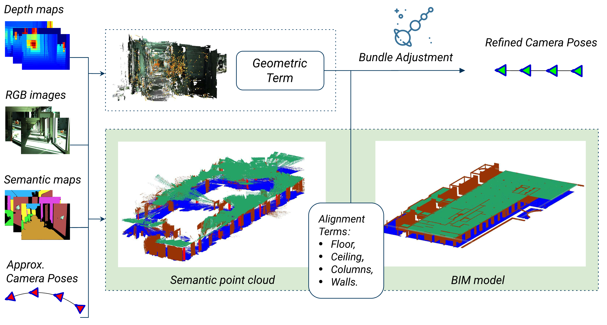
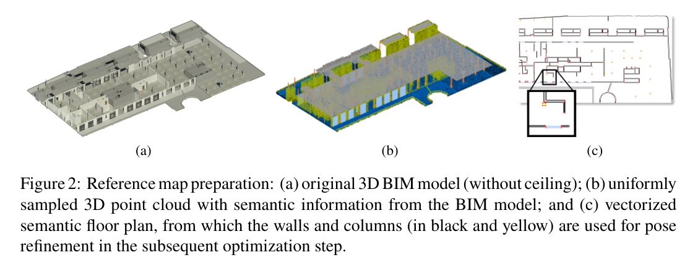

<h1 align="center" style="border-bottom: none">
    <b>
        BIMCaP 
    </b>	
 </h1>
<p align="center">
 BIM-based AI-supported LiDAR-Camera Pose Refinement.
</p>


 
<p align="center">
    <a href="https://arxiv.org/abs/2412.03434"><b>ArXiv Paper</b></a>  • 
    <a href="https://mediatum.ub.tum.de/1743877"><b>BIM model Data</b></a>  •  
    <a href="https://huggingface.co/erwinqi"><b>Construcion Site Semantic Segmentation Data</b></a>
</p>

This repository will contain the implementation of BIM-based AI-supported LiDAR-Camera Pose Refinement [paper](https://mediatum.ub.tum.de/node?id=1748534).
This project is an extension of the [FACaP](https://github.com/SamsungLabs/FACaP) project.

## Introduction

This paper introduces a method conceived to overcome the challenge of integrating mobile 3D sparse LiDAR data and camera measurements with pre-existing building information models (BIM models). This enhancement is crucial for fast and accurate mapping conducted with affordable sensors within indoor environments. 
Our proposed framework, termed BIMCaP, presents a novel approach for automatic sensor pose refinement, leveraging a reference 3D BIM model. 
Central to our methodology is the application of a bundle adjustment technique, which seamlessly aligns semantically enhanced measurements from the real world with a BIM model. 
Through experimentation on real-world open-access data, we demonstrate the superior accuracy of our framework, surpassing current state-of-the-art methods. 
BIMCaP holds significant promise for enhancing the efficiency and cost-effectiveness of 3D mapping methodologies. 
This advancement carries substantial advantages across various domains, such as in construction site management and emergency response, where up-to-date digital maps facilitate better decision-making and enhanced productivity.



We enhance the original FACaP pipeline by leveraging a 3D BIM model, fusioning sparse LiDAR and Camera sensors and implementing semantic segmentation on challenging construction site environments.




## Installation

We recommend using `Dockerfile` to build a container for the project. 
All required libraries are described in the environment file `env.yaml`. In the final version
we drop all of the `pytorch3d` dependencies, so you do not have to install it. 

## Data structure
All scans should be preprocessed to the next structure:
```
scan
│   floorplan.npy
|   floorplane.ply
|   ceiling.ply
│   
└───db
│   └───sparse
│       └───0
|           |   cameras.bin
|           |   images.bin
|           |   points3D.bin
│
└───arcore
│   │   cam_params.txt
│   │   ...
│   │   depth-0001.png
│   │   ...
│   │   frame-0001.png
│   │   ...
│   │   pose-0001.txt
│   │   ...
│   │
│
└───segmentation
│   │   frame-0001_wall.png
│   │   ...
│   │   frame-0001_floor.png
│   │   ...
│   │   frame-0001_ceiling.png
│   │   ...
│   │   frame-0001_columns.png
│  

```

Here:
- `floorplan.npy` is an array with the shape `n x 4`. Each element is a segment of the floorplan.
- `floorplane.ply` is a pointcloud of the floor in the BIM model.
- `ceiling.ply` is a pointcloud of the ceiling in the BIM model.
- `db` features a database in COLMAP format, which is used to map covisible points. This can be computed from the image frames using the [COLMAP](https://colmap.github.io/cli.html) automatic reconstructor.
- `cam_params.txt` intrinsics of the corresponding camera (w, h, f1, f1, p1, p2).
- `pose-0001.txt` extrinsic matrix of the corresponding camera
- `depth-0001.npy` depth map
- `frame-0001.png` RGB frame
- `frame-0001_wall.png` mask of walls for the corresponding frame
- `frame-0001_floor.png` mask of the floor for the corresponding frame
- `frame-0001_ceiling.png` mask of the ceiling for the corresponding frame
- `frame-0001_columns.png` rotated mask of the columns for the corresponding frame


For more details please see the file `facap/data/scan.py`. 

## Usage

To run an experiment you should create a config file run experiment. 

```python
    python scripts/run_experimnt.py --config path_to_config --device "cuda:0"
```

The example of the config can be found in the path `experiments/config.yaml`.

## Citation

```BibTeX

@inproceedings{Vega:2024:BIMCaP,
	author = {Vega-Torres, Miguel A. and Ribic, Anna and García de Soto, Borja and Borrmann, André},
	title = {BIMCaP: BIM-based AI-supported LiDAR-Camera Pose Refinement},
	booktitle = { Proc. of the 31th Int. Conference on Intelligent Computing in Engineering (EG-ICE)},
	year = {2024},
	month = {Jul},
	doi = {https://doi.org/10.48550/arXiv.2412.03434},
	keywords = {Construction Robotics; SLAM; BIM; Bundle Adjustment; Long-term Mapping},
	url = {https://github.com/MigVega/BIMCaP}
}

```

## Acknowledgements
This project is an extension of [FACaP](https://github.com/SamsungLabs/FACaP) by Sokolova, Anna and Nikitin, Filipp and Vorontsova, Anna and Konushin, Anton, which is licensed under the MIT License.

## License
For academic usage, the code is released under the [GPLv3 license](https://www.gnu.org/licenses/gpl-3.0.en.html). For any commercial purpose, please contact the authors.
